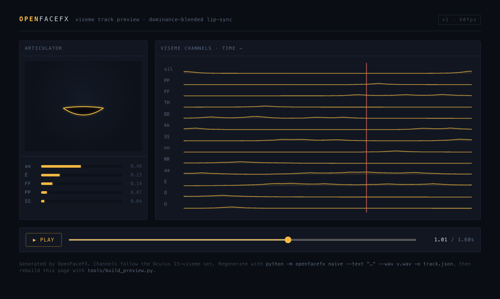
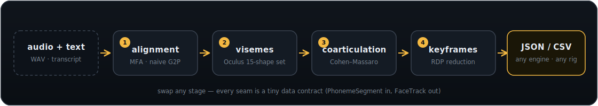

<div align="center">


# OpenFaceFX

**Open-source lip-sync in the spirit of FaceFX: voice recording + transcript → animation curves that drive a character's face.**

[](https://github.com/OpenFaceFX/OpenFaceFX/actions/workflows/ci.yml)
[](LICENSE)
[](pyproject.toml)
[](pyproject.toml)
[](#scope--honesty)

**[▶ Live demo](https://openfacefx.github.io/OpenFaceFX/demo/)** — no install, regenerated from the current pipeline on every push.



*The built-in previewer playing a track generated from `examples/voice.wav` — schematic articulator on the left, the exported viseme curves with a scrubbing playhead on the right. [Try it live.](https://openfacefx.github.io/OpenFaceFX/demo/)*

</div>

## What it is

FaceFX-style tools are really four subsystems chained together. Only the first
(acoustic alignment) needs a heavy model — and excellent open-source aligners
already exist. So OpenFaceFX **wraps** the aligner instead of reinventing it,
and fully owns the other three stages:



1. **Alignment** — time-stamped phonemes from Montreal Forced Aligner (parser
   included), or a dependency-free naive aligner for instant prototyping.
2. **Phoneme → viseme** — the widely-adopted Oculus/Meta 15-viseme convention.
3. **Coarticulation** — Cohen–Massaro dominance blending, so mouth shapes flow
   into each other instead of switching.
4. **Keyframe reduction** — Ramer–Douglas–Peucker thinning into sparse,
   engine-friendly curves.

Every seam is a tiny data contract (`PhonemeSegment` in, `FaceTrack` out), so
any stage can be swapped without touching the rest.

## Install

```bash
pip install -e .          # numpy is the only runtime dependency
```

## Quick start

No models, no downloads — approximate lip-sync from text + a WAV's duration:

```bash
python -m openfacefx naive \
  --text "hello world this is a test" \
  --wav examples/voice.wav \
  -o track.json
```

Accurate lip-sync from a Montreal Forced Aligner result:

```bash
# 1. run MFA (separately) to get voice.TextGrid, then:
python -m openfacefx mfa --textgrid voice.TextGrid -o track.json
```

Straight from a TTS engine's own timing — skip the aligner (espeak/MBROLA
`.pho`, Piper, or Cartesia phonemes; Azure or Polly visemes; details and
capture scripts in [docs/timing.md](docs/timing.md)):

```bash
python -m openfacefx from-timing --file visemes.json --format azure -o track.json
```

Or pin the naive aligner at known word/segment boundaries — subtitle cue times or
TTS word timestamps (SRT, Azure/ElevenLabs/Kokoro/Google) — for much better sync
with no models (SRT supplies its own transcript; the rest take `--text`):

```bash
python -m openfacefx naive --anchors cues.srt --anchors-format srt --wav voice.wav -o track.json
```

Straight to a Unity AnimationClip, or remapped onto another rig:

```bash
python -m openfacefx naive --text "..." --wav voice.wav -o clip.anim   # viseme_* curves
python -m openfacefx naive --text "..." --wav voice.wav -o clip.anim --anim-naming vrchat
python -m openfacefx mfa --textgrid voice.TextGrid -o track.json --retarget arkit
```

Whole dialogue trees at once, with an OOV/confidence QA report and
incremental re-runs:

```bash
python -m openfacefx batch --dir voice/ --out tracks/ --recurse --modified-only --jobs 8
```

Weighted many-to-many phoneme mapping and coarticulation timing are
data/parameters, not code — see `examples/mappings/` and `CoartParams`.

Library use:

```python
from openfacefx import generate_naive, load_mfa_textgrid, generate_from_alignment, write_json

track = generate_naive("the quick brown fox", duration=1.8)      # quick path
# or, accurate:
segs  = load_mfa_textgrid("voice.TextGrid")
track = generate_from_alignment(segs)
write_json(track, "track.json")
```

## Preview what you generated

`examples/preview.html` is a self-contained page (no server needed) that
animates a schematic mouth from a track and plots every viseme channel with a
scrubbing playhead. Rebuild it for your own track:

```bash
python tools/build_preview.py track.json preview.html
```

## Output format

Deliberately trivial JSON (CSV also available) — sparse `[time, value]` keys
per viseme channel, weights in `[0, 1]`:

```jsonc
{
  "format": "openfacefx.track",
  "version": 1,
  "fps": 60.0,
  "duration": 1.6,
  "viseme_set": ["sil", "PP", "FF", "TH", "DD", "kk", "CH", "SS", "nn", "RR", "aa", "E", "I", "O", "U"],
  "channels": [
    { "name": "PP", "keys": [[0.0, 0.0], [0.9167, 0.0094], [1.0167, 0.0737]] }
  ]
}
```

Channel names are blendshape names your rig exposes; linear interpolation
between keys is the intended playback. A reference reader is ~15 lines — see
[docs/COMPATIBILITY.md](docs/COMPATIBILITY.md).

## Plugging in a real aligner (stage 1)

The naive aligner spaces phonemes by duration priors — fine for prototyping,
not for shipping. For production accuracy, produce a list of
`PhonemeSegment(phoneme, start, end)` from any of these and pass it to
`generate_from_alignment`:

- **Montreal Forced Aligner** — best accuracy; parser included (`load_mfa_textgrid`).
- **Gentle** — Kaldi-based, JSON output; write a ~15-line adapter.
- **wav2vec2 / Whisper** — phoneme or word timings from a neural model; word-level
  needs no transcript.

Better G2P: drop in the full CMU Pronouncing Dictionary with
`G2P().load_cmudict("cmudict.dict")` (the built-in dictionary is a tiny seed).

## The viseme set

15 targets from the Oculus/Meta LipSync convention (`sil, PP, FF, TH, DD, kk,
CH, SS, nn, RR, aa, E, I, O, U`) — a well-documented, IP-free convention most
character rigs already provide blendshapes for. To retarget to a different rig
(Apple ARKit's 52 blendshapes, a Preston-Blair 12-shape set, …), edit
`PHONEME_TO_VISEME` and `VISEMES` in `visemes.py` — nothing else changes.

## FaceFX ecosystem compatibility

We surveyed every public FaceFX wrapper on GitHub. The short version: **all of
them are parallel audio+text generators, not curve consumers** — none accepts
any lip-sync tool's curves as input, so "drop-in" compatibility is impossible
by design, for us and everyone else. What *is* possible is writing the
artifacts their pipelines consume:

| Ecosystem | Route | Status |
|---|---|---|
| Unity / VRChat / Ready Player Me | `-o clip.anim` — AnimationClip with `viseme_*` or `vrc.v_*` blendshape curves | ✅ shipped |
| ARKit / Rhubarb / VRM / CC4 rigs | `--retarget arkit\|rhubarb\|vrm\|cc4` weighted remaps ([docs](docs/retargeting.md)) | ✅ shipped |
| Unreal (official FaceFX-UE4/UE5 plugins) | Impossible via the plugins (proprietary `.ffxc` compiler); instead drive UE float curves / morph targets from JSON — the `arkit` remap feeds MetaHuman's ARKit route | ✅ JSON today |
| Bethesda modding (Nukem9/FaceFXWrapper, xVASynth, Mantella) | `.fuz` container + `.lip` header tools shipped (`openfacefx.bethesda`); the `.lip` payload has **no public spec** — clean-room writer blocked on sample reverse-engineering ([#12](https://github.com/OpenFaceFX/OpenFaceFX/issues/12)) | 🔶 partial |
| Anything else | Trivial JSON/CSV + documented remap | ✅ today |

Full survey with per-tool details: [docs/COMPATIBILITY.md](docs/COMPATIBILITY.md).

## Roadmap

The full backlog lives in the [issues](https://github.com/OpenFaceFX/OpenFaceFX/issues)
(milestone v0.2.0), distilled from a feature-gap survey against FaceFX.

- [x] Unity `AnimationClip` exporter (`-o clip.anim`, oculus/vrchat naming)
- [x] Published remap tables: ARKit-52, Rhubarb, Preston-Blair, VRM, CC4
- [x] Component-based coarticulation with tunable articulator timing ([#1](https://github.com/OpenFaceFX/OpenFaceFX/issues/1))
- [x] Data-driven weighted phoneme→target mapping ([#2](https://github.com/OpenFaceFX/OpenFaceFX/issues/2))
- [x] Batch directory processing with QA reports ([#3](https://github.com/OpenFaceFX/OpenFaceFX/issues/3))
- [ ] Bethesda `.LIP` exporter — blocked on payload spec ([#12](https://github.com/OpenFaceFX/OpenFaceFX/issues/12)); `.fuz`/header tools + research codec shipped
- [ ] Prosody, gestures, events, text tags, i18n ([#4](https://github.com/OpenFaceFX/OpenFaceFX/issues/4)–[#8](https://github.com/OpenFaceFX/OpenFaceFX/issues/8))

## Scope & honesty

This is a working foundation, not a finished product. It gives you the full
phoneme→viseme→curve→export chain and a preview, with a clean seam where a
real acoustic aligner plugs in. Not yet included: emotion layering, a rig
authoring GUI, audio feature-driven coarticulation (it's timing-driven), and
engine plugins beyond JSON/CSV. All of these fit on top of `FaceTrack` without
changing the solver. It does **not** read or write proprietary FaceFX binary
formats (`.facefx`, `.fxa`, `.fxe`, `.ffxc`).

## Layout

```
src/openfacefx/
  phonemes.py       ARPAbet inventory
  g2p.py            word → phonemes (CMUdict + rule fallback)
  alignment.py      PhonemeSegment, NaiveAligner, MFA TextGrid parser
  timing.py         TTS phoneme/viseme timing adapters (from-timing) ← skip the aligner
  anchors.py        word/segment-anchored naive alignment (SRT + TTS word timings)
  visemes.py        viseme set + phoneme→viseme map
  mapping.py        weighted phoneme→target mapping (JSON)  ← remap phonemes here
  coarticulation.py component dominance blending, CoartParams ← the interesting math
  curves.py         keyframe reduction, FaceTrack
  io_export.py      JSON / CSV writers
  export_unity.py   Unity .anim AnimationClip writer
  retarget.py       viseme→rig remapping + presets          ← retarget rigs here
  bethesda.py       .fuz container / .lip header tools
  batch.py          directory batch runner + QA summary
  pipeline.py       orchestration
  cli.py            command line
tests/test_core.py  run: pytest
tools/              HTML previewer builder
docs/               logo, images, compatibility survey
```

CI runs the test suite plus CLI and preview-builder smoke tests on every push,
across Linux / Windows / macOS on Python 3.9, 3.12 and 3.13.

## License

MIT — see [LICENSE](LICENSE).

*FaceFX® is a registered trademark of OC3 Entertainment, Inc. OpenFaceFX is an
independent project — not affiliated with, endorsed by, or connected to OC3
Entertainment or Speech Graphics — and contains no code or data from FaceFX
products.*
